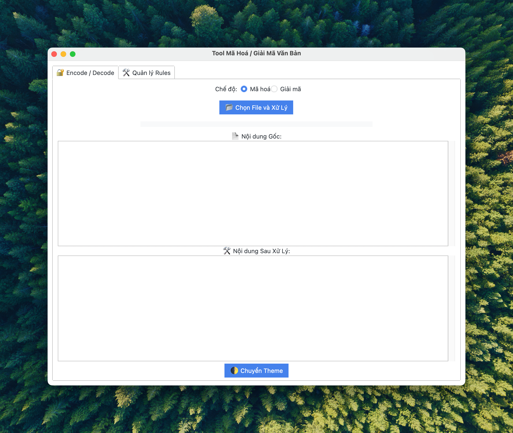

# 🛡️ Tool Mã Hoá / Giải Mã Văn Bản (`encodeappl`)


Ứng dụng mã hoá / giải mã từ văn bản trong các định dạng `.docx`, `.xlsx`, `.pptx`, `.txt`  
Viết bằng Python 3.11 + Tkinter (ttkbootstrap), đóng gói PyInstaller.

---

## 🖼️ Giao diện chính

| Encode / Decode Tab | Quản lý Rules Tab |
|----------------------|-------------------|
|  |  |

> 📌 *Screenshot lưu trong thư mục `docs/`*

---

## 📦 Tải bản dùng ngay

| Phiên bản | Link tải | Ghi chú |
|----------|----------|--------|
| `MacOS .app` | [Download main_app-macOS.zip](https://github.com/your-username/encodeappl/releases) | Dùng trực tiếp trên macOS |
| `Windows .exe` | _Coming soon_ | |

---

## 🔧 Build thủ công

```bash
bash build.sh
